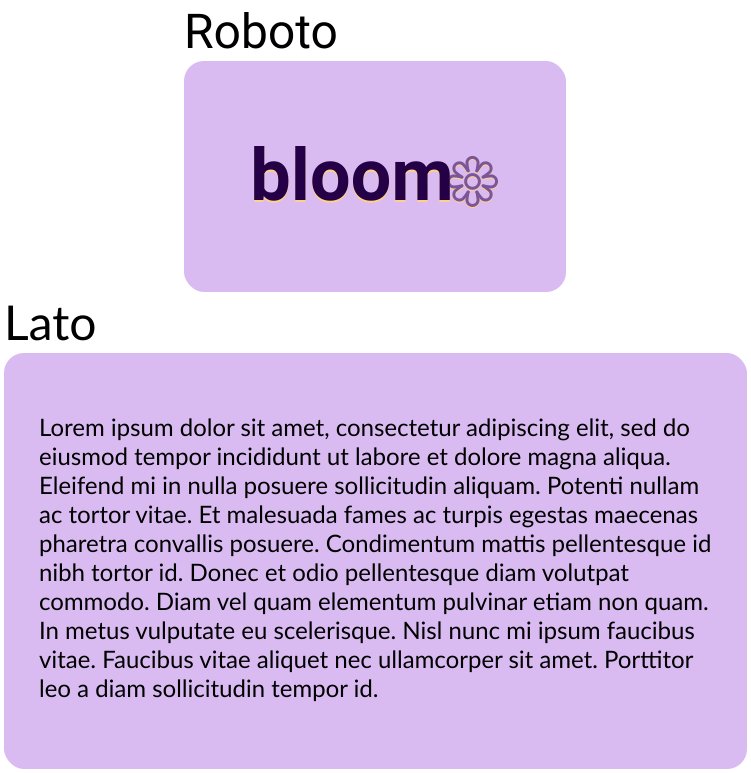
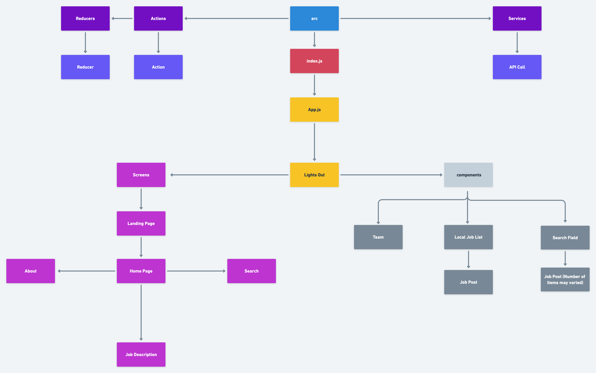

# 
 

### `“Helping you blossom into your next career”`

## 
 🔎 Description 🔍

The economic toll of the COVID-19 pandemic is expected to leave more than 140 million people out of work and another 1.6 billion at risk of income loss -- with low-income workers, women and underrepresented communities the hardest hit.

The goal of the web/mobile application is to streamline the job hunting process for remote workers. We will help decrease the amount of time it takes to find remote roles using our remote job API with positions located all over the world. With our app,  job seekers can find roles they can apply to and work from anywhere in the world.

## 
 🛠 Wireframing 🛠 

[App Concepts](https://www.figma.com/file/ag4FxZ6ylZVhcD11s4rNpN/Project-Bloom?node-id=17%3A202)
| Logo                                                         |                                                              |
| ------------------------------------------------------------ | ------------------------------------------------------------ |
|  |  |
| icon                                                         | logo                                                         |

| Fonts                                                              |
| ------------------------------------------------------------------ |
|  |

| Mockups                                                                            |                                                                                  |                                                                                         |
| ---------------------------------------------------------------------------------- | -------------------------------------------------------------------------------- | --------------------------------------------------------------------------------------- |
|  |  |  |
| Desktop                                                                            | Tablet                                                                           | Mobile                                                                                  |

## 
 🖇 Component Hierarchy 🖇  

[App Component Hierarchy](https://whimsical.com/project-bloom-Eypnmjf9Diz6WejykobjSM@2Ux7TurymMwgkHyMFSAA)

|  |
| ----------------------------------------------------------------------------------------------- |
| component hierarchy                                                                             |

## 
 🗄 API 🗄 

| API                                                                                                           | Description                                                                                     |
| ------------------------------------------------------------------------------------------------------------- | ----------------------------------------------------------------------------------------------- |
|  | The Remotive Job API allows you to retrieve jobs based on category, company name, and searches. |

## 
 🏆 MVP 🏆

> - Search Bar
> - Locations near me
> - Light/Dark Mode

## 
 🔮 Post-MVP 🔮 

> - Saving Jobs to Favorite Local Storage (heart or star)
> - Advanced search using another job API, includes internships,apprenticeships, externships etc
> - Job recommendations based on a technology you know 
> - Virtual hiring Events tab
> - Blog with relevant job prep articles
> - Diversity focus to match diverse candidates in tech roles
> - Search bar autocomplete to save time when looking for roles

## 
 📠 Contact 📠

| Angel B.Fernandez                                                                                                                                                                 | David Espinal                                                                                                                                                                    | Quiana C. Berry                                                                                                                                                                      |
| --------------------------------------------------------------------------------------------------------------------------------------------------------------------------------- | -------------------------------------------------------------------------------------------------------------------------------------------------------------------------------- | ------------------------------------------------------------------------------------------------------------------------------------------------------------------------------------ |
|   |   |   |
|                                                                                                                                                                                   |                                                                                                                                                                                  |                                                                                                                                                                                      |
